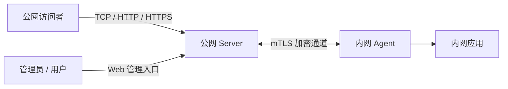

# Nexo 联巢

**将内网服务发布到公网，集中管理访问入口。**

Nexo 是一个自托管内网穿透平台，通过轻量 Agent 将内网 TCP、HTTP、HTTPS 服务发布到公网，提供可视化管理、独立工作空间、域名接入检查和自动 HTTPS 证书管理。适合访问家中或办公室的 Web 应用、开发服务和其他 TCP 服务。

[快速部署](#快速部署) · [发布第一个服务](#发布第一个服务) · [使用指南](https://github.com/thelinyue/Nexo/blob/master/docs/usage.md) · [容器与维护](https://github.com/thelinyue/Nexo/blob/master/docker/README.md) · [版本说明](https://github.com/thelinyue/Nexo/releases)

## 核心能力

| 能力 | 说明 |
| --- | --- |
| TCP / HTTP / HTTPS | 配置本地目标、公网端口或域名，支持 WebSocket |
| 可视化管理 | 创建、编辑、启停服务，查看状态并复制访问地址 |
| Agent 身份管理 | 入网审批、mTLS 加密通道、证书自动续签与身份恢复 |
| 多用户工作空间 | 邀请加入，分别管理 Agent、服务、域名和证书 |
| 域名与证书 | 检查域名归属及解析，通过 Caddy 自动申请与续期证书，支持 Cloudflare DNS-01 |

## 工作方式



Server 部署在公网可达的 Linux 主机上，提供管理页面和公网入口；Agent 部署在能够访问内网应用的 Linux 主机上，主动连接 Server。访问者使用浏览器或应用自己的客户端，无需安装 Nexo。Agent 不需要虚拟网卡或特权网络能力。

## 部署前准备

- Server 和 Agent 的官方镜像支持 **Linux/amd64**；主机需安装 Docker Engine 和 Docker Compose v2。
- Server 需要公网可达的地址。Agent 需能访问 Server 的管理 API、控制端口、数据端口及本地目标应用。
- TCP 服务不需要域名；HTTP/HTTPS 服务需要自己拥有并能配置 DNS 的域名。
- 默认使用 host 网络，先确认 Server 的相关端口没有被其他程序占用。同机反向代理与 Caddy 不能同时监听同一地址的 `80/443`，具体安排见 [容器说明](https://github.com/thelinyue/Nexo/blob/master/docker/README.md#管理入口与账号恢复)。

| Server 端口 | 用途 | 访问要求 |
| --- | --- | --- |
| TCP `8280` | Web 管理与入网 API | 初始化阶段限制为可信来源；公网使用时配置 HTTPS 反向代理 |
| TCP `9890` / `9891` | Agent 控制 / Tunnel 数据 | 允许 Agent 访问；必须直连或 TCP 透传，不可中间终止 TLS |
| TCP `80` / `443` | Web 服务与 HTTPS 证书验证 | 使用 Web Tunnel 时开放；HTTP-01 验证依赖标准端口 |
| TCP `20000–29999` | TCP 服务公网端口池 | 开放实际分配端口；需要任意自动分配端口均可访问时再放行整个范围 |
| UDP `443` | HTTP/3 | 可选；普通 HTTPS 不要求此项 |

**从 v0.1.x 切换：** 当前产品自 v0.2.0 起仅支持全新安装，不迁移旧版组网数据。请备份并保留旧目录、镜像和配置，给新 Server 与 Agent 使用空数据目录。检测到旧结构时 Server 会拒绝启动，不会转换或删除旧数据。

## 快速部署

默认镜像使用 `latest`，分别指向 Server 和 Agent 的最新稳定版。数字版本继续保留用于定位问题和回退。`latest` 不会让正在运行的容器自动升级；已有安装请阅读下方“维护与更新”，不要重跑新安装步骤。

### 1. 启动 Server

在 Server 主机新建安装目录。若目录已存在，停止新安装步骤并检查原部署：

```bash
mkdir "$HOME/nexo-server-latest" && cd "$HOME/nexo-server-latest"
```

在此目录创建 `compose.yml`，填写以下完整内容：

```yaml
name: nexo

# Nexo 最新稳定版 Server。首次安装使用空数据目录，更新时保留原目录。
services:
  nexo-server:
    image: ghcr.io/thelinyue/nexo-server:latest
    container_name: nexo-server
    network_mode: host
    environment:
      TZ: ${TZ:-Asia/Shanghai}
      NEXO_PUBLIC_URL: ${NEXO_PUBLIC_URL:-}
      NEXO_TRUSTED_PROXIES: ${NEXO_TRUSTED_PROXIES:-}
      NEXO_PUBLIC_IPS: ${NEXO_PUBLIC_IPS:-}
    volumes:
      - ./data/nexo:/data/nexo
    restart: unless-stopped
    healthcheck:
      test: ["CMD-SHELL", "curl --fail --silent http://127.0.0.1:8280/health >/dev/null"]
      interval: 10s
      timeout: 3s
      retries: 6
```

启动并查看状态：

```bash
docker compose -f compose.yml pull nexo-server
docker compose -f compose.yml up -d nexo-server
docker compose -f compose.yml ps
```

从可信网络打开 `http://服务器地址:8280`，按提示创建唯一管理员。首次初始化没有默认账号或密码。持久数据位于当前目录的 `data/nexo`。

面向公网使用前，为管理入口配置 HTTPS，并设置 `NEXO_PUBLIC_URL`、`NEXO_TRUSTED_PROXIES`；完整说明见 [管理入口](https://github.com/thelinyue/Nexo/blob/master/docker/README.md#管理入口与账号恢复)。Agent 的 Server URL 也应使用此 HTTPS 地址。

### 2. 接入 Agent

在管理页面进入“Agent → 添加 Agent”，生成并复制一次性入网凭证，有效期 1 小时。然后在能够访问内网应用的主机新建目录；已有 Agent 请使用原目录管理，避免丢失身份：

```bash
mkdir "$HOME/nexo-agent-latest" && cd "$HOME/nexo-agent-latest"
```

创建 `compose.agent.yml`：

```yaml
name: nexo-agent

# 每个需要公网 Tunnel 的站点运行一个 Agent。Agent 可连接任意 Nexo Server。
services:
  nexo-agent:
    image: ghcr.io/thelinyue/nexo-agent:latest
    container_name: nexo-agent
    network_mode: host
    environment:
      TZ: ${TZ:-Asia/Shanghai}
      NEXO_SERVER_URL: ${NEXO_SERVER_URL:?请在 .env 中填写 NEXO_SERVER_URL}
      NEXO_ENROLLMENT_TOKEN: ${NEXO_ENROLLMENT_TOKEN:-}
    volumes:
      - ./data/nexo-agent:/data/nexo-agent
    restart: unless-stopped
```

在同一目录创建 `.env`。先限制文件权限，再用文本编辑器填入 Agent 可访问的 Server Web/API 地址和刚生成的凭证；将下方示例值替换为实际值：

```bash
umask 077
touch .env
chmod 600 .env
```

```dotenv
TZ=Asia/Shanghai
NEXO_SERVER_URL='https://nexo.example.com'
NEXO_ENROLLMENT_TOKEN='替换为刚生成的入网凭证'
```

启动 Agent 后，回到管理页面核对入网申请，批准并设置名称，等待状态变为在线：

```bash
# 避免当前 Shell 中的同名变量覆盖 .env。
unset NEXO_SERVER_URL NEXO_ENROLLMENT_TOKEN TZ
docker compose -f compose.agent.yml pull nexo-agent
docker compose -f compose.agent.yml up -d nexo-agent
docker compose -f compose.agent.yml logs --tail=50 nexo-agent
```

Agent 身份保存在 `data/nexo-agent`。入网成功后可清空 `.env` 中的凭证值，后续重启复用原身份；不要把同一身份目录复制到多台主机。

## 发布第一个服务

### TCP：先验证基本链路

假设 Agent 所在主机已有一个监听 `127.0.0.1:8080` 的 HTTP 应用：

1. 在“穿透服务”新建服务，协议选 TCP，选择刚批准的 Agent。
2. 本地地址填 `127.0.0.1`，本地端口填 `8080`，公网端口留空以自动分配。
3. 保存后放行分配的公网 TCP 端口，并等待服务正常。
4. 从外部网络访问 `http://Server公网IP:分配端口`，确认打开的是该应用。

这里使用 TCP 转发 HTTP 应用便于浏览器验收；其他 TCP 应用使用各自客户端访问。若应用在局域网另一台主机上，本地地址应填写那台主机的内网 IP。

### HTTPS：使用自己的域名

1. 在“域名与证书”添加 `example.com`，按提示添加 TXT 记录完成归属验证，或提交该域名的 Cloudflare Token 验证。
2. 在 DNS 服务商添加 `app.example.com` 的 A 记录，指向 Server 的公网 IPv4；没有可达 IPv6 时不要添加 AAAA。
3. 新建 HTTPS 服务，选择 Agent，绑定该域名，服务子域名填 `app`，本地目标填实际应用地址和端口。
4. 默认 HTTP-01 需要公网 TCP `80/443` 可达。等待配置加载、解析与证书状态正常，再从外部网络打开 `https://app.example.com`。

公网 HTTPS 由 Caddy 终止，本地目标默认使用 HTTP，无需给内网应用安装公网证书。Cloudflare DNS-01 支持泛域名签发，但**不会自动创建访问所需的 A/AAAA 记录**。DNS 检查成功也不能代替真实外网访问。

## 维护与更新

Server 与 Agent 独立发布，二者的数字版本可能不同。更新前阅读发布说明并备份完整数据目录；只对本次实际更新的组件执行拉取和重建，保留另一端的容器与节点身份。

以只更新 Server 为例，在原 Server 安装目录执行：

```bash
docker compose -f compose.yml pull nexo-server
docker compose -f compose.yml up -d --no-deps nexo-server
docker compose -f compose.yml ps
```

如果原配置固定了数字版本，需要先将对应组件的 `image` 改为 `latest`。不要通过删除数据目录更新或回退；版本回退前确认数据兼容性，必要时使用与旧镜像匹配的完整备份。详细步骤见 [更新、备份与恢复](https://github.com/thelinyue/Nexo/blob/master/docker/README.md#更新备份与恢复)。

| 需要帮助 | 文档 |
| --- | --- |
| 服务操作、用户分享、工作空间、域名和证书 | [使用指南](https://github.com/thelinyue/Nexo/blob/master/docs/usage.md) |
| 环境变量、HTTPS 管理入口、备份恢复、排障 | [容器说明](https://github.com/thelinyue/Nexo/blob/master/docker/README.md) |
| 本机验证、真实流量验收与测试边界 | [穿透验收](https://github.com/thelinyue/Nexo/blob/master/docs/network-experience.md) |
| 版本变化与兼容说明 | [GitHub Releases](https://github.com/thelinyue/Nexo/releases) · [更新记录](https://github.com/thelinyue/Nexo/blob/master/CHANGELOG.md) |

## 开发与安全

项目使用 Rust 与 React。以下命令在仓库根目录运行；浏览器和真实流量验收见上述穿透验收文档：

```bash
cargo fmt --all -- --check
cargo test --workspace --locked
cargo clippy --workspace --all-targets --locked -- -D warnings
cd web
npm ci --ignore-scripts
npm run build
```

漏洞请按 [安全策略](https://github.com/thelinyue/Nexo/blob/master/SECURITY.md) 私密报告，不要在公开 Issue 中提交 Token、私钥或包含凭据的日志。

## 许可证

Nexo 以 [AGPL-3.0-only](LICENSE) 发布，第三方声明见 [THIRD_PARTY_NOTICES.md](THIRD_PARTY_NOTICES.md)。
