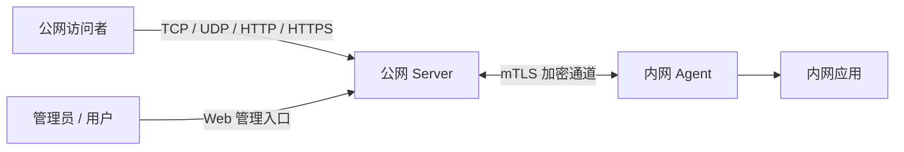

# Nexo 联巢

**将内网服务发布到公网，集中管理访问入口。**

Nexo 是一个自托管内网穿透平台，通过轻量 Agent 将内网 TCP、UDP、HTTP、HTTPS 服务发布到公网，提供可视化管理、独立工作空间、域名接入检查和自动 HTTPS 证书管理。适合访问家中或办公室的 Web 应用、开发服务和远程桌面和其他 TCP/UDP 服务。

[快速部署](#快速部署) · [发布第一个服务](#发布第一个服务) · [使用指南](https://github.com/thelinyue/Nexo/blob/master/docs/usage.md) · [容器与维护](https://github.com/thelinyue/Nexo/blob/master/docker/README.md) · [版本说明](https://github.com/thelinyue/Nexo/releases)

## 核心能力

| 能力 | 说明 |
| --- | --- |
| TCP / UDP / TCP+UDP / HTTP / HTTPS | 配置本地目标、公网端口或域名，支持 WebSocket |
| 可视化管理 | 创建、编辑、启停服务，查看状态并复制访问地址 |
| Agent 身份管理 | 共享密钥自动接入、mTLS 加密通道、证书自动续签与身份恢复 |
| 多用户工作空间 | 邀请加入，分别管理 Agent、服务、域名和证书 |
| 域名与证书 | 验证域名归属，通过 Caddy 自动申请与续期证书，支持 Cloudflare DNS-01 |

## 工作方式


```mermaid
flowchart LR
    Visitor[公网访问者] -->|TCP / UDP / HTTP / HTTPS| Server[公网 Server]
    Server <-->|mTLS 加密通道| Agent[内网 Agent]
    Agent --> App[内网应用]
    Admin[管理员 / 用户] -->|Web 管理入口| Server
```

Server 部署在公网可达的 Linux 主机上，提供管理页面和公网入口；Agent 部署在能够访问内网应用的 Linux 主机上，主动连接 Server。访问者使用浏览器或应用自己的客户端，无需安装 Nexo。Agent 不需要虚拟网卡或特权网络能力。

## 部署前准备

- Server 和 Agent 的官方镜像支持 **Linux/amd64**；主机需安装 Docker Engine 和 Docker Compose v2。
- Server 需要公网可达的地址。Agent 需能访问 Server 的管理 API、控制端口、数据端口及本地目标应用。
- TCP/UDP 服务不需要域名；HTTP/HTTPS 服务需要自己拥有并能配置 DNS 的域名。
- 默认使用 host 网络，先确认 Server 的相关端口没有被其他程序占用。同机反向代理与 Caddy 不能同时监听同一地址的 `80/443`，具体安排见 [容器说明](https://github.com/thelinyue/Nexo/blob/master/docker/README.md#管理入口与账号恢复)。

| Server 端口 | 用途 | 访问要求 |
| --- | --- | --- |
| TCP `8280` | Web 管理与入网 API | 限制为可信来源；公网使用时配置 HTTPS 反向代理 |
| TCP `9890` / `9891` | Agent 控制 / Tunnel 数据 | 允许 Agent 访问；必须直连或 TCP 透传，不可中间终止 TLS |
| TCP `80` / `443` | Web 服务与 HTTPS 证书验证 | 使用 Web Tunnel 时开放；HTTP-01 验证依赖标准端口 |
| TCP/UDP `20000–29999` | TCP/UDP 服务公网端口池 | 开放实际分配端口；需要任意自动分配端口均可访问时再放行整个范围 |
| UDP `9891` | Agent QUIC 数据通道 | 使用 UDP 或 TCP+UDP 时开放，直连 Server；普通 HTTP 代理不支持 |
| UDP `443` | HTTP/3 | 可选；普通 HTTPS 不要求此项 |

**版本要求：** 本次发布 Server 与 Agent v0.2.9，支持自定义 HTTPS 端口和可选 IPv6 直连。已有 v0.2.5 至 v0.2.8 部署可保留数据和身份，Server 自动补充所需字段，已有服务默认端口 443、直连关闭。启用直连需要两端升级；旧 Agent 可继续使用原 Tunnel。从 v0.2.4 或更早版本安装时，两端均须使用独立空数据目录，不迁移旧数据库或身份。读取失败会报错并保留文件。

## 快速部署

默认镜像标签为 `latest`；固定版本部署及已有实例更新步骤见 [v0.2.9 发布说明](docs/releases/v0.2.9.md)。Server 与 Agent 按实际代码变化独立发布。

### 1. 启动 Server

在 Server 主机新建安装目录。若目录已存在，停止新安装步骤并检查原部署：

```bash
mkdir "$HOME/nexo-server-latest" && cd "$HOME/nexo-server-latest"
```

在此目录创建 `compose.yml`，填写以下完整内容：

```yaml
name: nexo

# Nexo 最新稳定版 Server，配置保存在 data/nexo/server.toml；更新前查阅对应发布说明。
services:
  nexo-server:
    image: ghcr.io/thelinyue/nexo-server:latest
    container_name: nexo-server
    network_mode: host
    # host 网络直接使用宿主机端口，不提供以下 ports 映射；部分 Compose 版本可能拒绝两者同时配置。
    # 按需保留此端口清单；实际监听与对外开放由 Server 和宿主机防火墙决定。
    ports:
      - "80:80/tcp"                    # Web Tunnel 与 HTTP-01 证书验证
      - "443:443/tcp"                  # HTTPS Web Tunnel
      - "443:443/udp"                  # 可选：HTTP/3
      - "8280:8280/tcp"                # Web 管理与入网 API；桥接发布时应限制可信来源
      - "9890:9890/tcp"                # Agent mTLS 控制连接
      - "9891:9891/tcp"                # Agent TCP Tunnel 数据
      - "9891:9891/udp"                # Agent QUIC 数据
      - "20000-29999:20000-29999/tcp"  # 自动分配的公网 TCP 服务端口
      - "20000-29999:20000-29999/udp"  # 自动分配的公网 UDP 服务端口
    environment:
      TZ: Asia/Shanghai
    volumes:
      - ./data/nexo:/data/nexo
    restart: unless-stopped
    healthcheck:
      test: ["CMD-SHELL", "curl --fail --silent http://127.0.0.1:8280/health >/dev/null"]
      interval: 10s
      timeout: 3s
      retries: 6
```

启动并查看状态：

```bash
docker compose -f compose.yml pull nexo-server
docker compose -f compose.yml up -d nexo-server
docker compose -f compose.yml ps
```

Server Compose 不要求 `.env` 文件，也可从宿主机环境或 `.env` 传入 `NEXO_ADMIN_USERNAME` / `NEXO_ADMIN_PASSWORD`。非空值分别优先于 `server.toml` 的 `admin.username` / `admin.password`，未设置或为空时回退到 TOML，仅首次创建账号生效。此环境变量支持从 Server v0.2.6 开始提供。

首次启动生成带中文注释的 `./data/nexo/server.toml`，默认监听 `0.0.0.0:8280` 并启用 Caddy，然后创建唯一管理员；未指定账号密码时，默认用户名为 `admin`，密码自动生成。通过以下命令查看首次启动日志中的用户名和密码：

```bash
docker compose -f compose.yml logs nexo-server
```

从可信网络打开 `http://服务器地址:8280`，直接使用上述账号登录。自动密码只在成功创建账号时输出一次，请妥善保存，分享日志前删除凭据。已有账号不会因重启而重设；密码遗失时执行 `docker compose -f compose.yml exec nexo-server nexo --data-dir /data/nexo admin recover`，然后在登录页选择“忘记密码”。持久数据位于当前目录的 `data/nexo`。

面向公网使用前，为管理入口配置 HTTPS。管理员登录后，在“账号设置 → 管理员功能 → 服务器设置”中选择已验证域名并填写子域名，内置 Caddy 自动配置反向代理、证书和强制 HTTPS；原 IP 管理入口保留，设置无需重启。完整说明见 [管理入口](https://github.com/thelinyue/Nexo/blob/master/docker/README.md#管理入口与账号恢复)。Agent 的 Server URL 也应使用此 HTTPS 地址。

### 2. 接入 Agent

在管理页面进入“Agent → 添加 Agent”。Compose 模式复制原生 YAML，可直接粘贴到 NAS 的 Compose 项目，或保存为 `compose.agent.yml`；docker run 模式复制单条启动命令到 Linux / NAS 终端执行。两种方式均已填入地址、接入密钥和设备名称，无需另外准备 TOML，也不包含安装脚本。配置含接入密钥，请勿分享。每个空间共用一把长期密钥，可接入多台设备，无需批准。以下为手动填写示例；已有 Agent 请使用原目录管理，保留身份：

```bash
mkdir "$HOME/nexo-agent-latest" && cd "$HOME/nexo-agent-latest"
```

创建 `compose.agent.yml`：

```yaml
name: nexo-agent

# Agent v0.2.7 起可直接通过环境变量连接，无需预先创建 TOML。
services:
  nexo-agent:
    image: ghcr.io/thelinyue/nexo-agent:latest
    container_name: nexo-agent
    network_mode: host
    environment:
      TZ: Asia/Shanghai
      NEXO_SERVER_URL: "https://nexo.example.com"
      NEXO_ENROLLMENT_TOKEN: "替换为空间接入密钥"
      NEXO_DEVICE_NAME: "家庭 NAS"
    volumes:
      - ./data/nexo-agent:/data/nexo-agent
    restart: unless-stopped
```

手动部署时，替换示例中的 Server 地址与空间接入密钥（页面“高级：接入密钥”可复制）。也可继续使用 [Agent TOML 配置](config/agent.toml)，此时删除上述三个环境变量或将它们留空。非空环境变量逐项优先于 TOML，不回写文件。

启动 Agent 后将自动接入，在管理页面查看设备是否在线：

```bash
docker compose -f compose.agent.yml pull nexo-agent
docker compose -f compose.agent.yml up -d nexo-agent
docker compose -f compose.agent.yml logs --tail=50 nexo-agent
```

Agent 身份保存在 `data/nexo-agent`。接入成功后可清空 `NEXO_ENROLLMENT_TOKEN` 或 `agent.toml` 中的 `enrollment_token`，保留 Server 地址，后续重启复用身份；不要把同一身份目录复制到多台主机。

## 发布第一个服务

### TCP：先验证基本链路

假设 Agent 所在主机已有一个监听 `127.0.0.1:8080` 的 HTTP 应用：

1. 在“穿透服务”新建服务，协议选 TCP，选择刚接入的 Agent。
2. 本地地址填 `127.0.0.1`，本地端口填 `8080`，公网端口留空以自动分配。
3. 保存后放行分配的公网 TCP 端口，并等待服务正常。
4. 从外部网络访问 `http://Server公网IP:分配端口`，确认打开的是该应用。

这里使用 TCP 转发 HTTP 应用便于浏览器验收；其他 TCP 应用使用各自客户端访问。若应用在局域网另一台主机上，本地地址应填写那台主机的内网 IP。

### HTTPS：使用自己的域名

1. 在“域名与证书”添加 `example.com`，按提示添加 TXT 记录完成归属验证，或提交该域名的 Cloudflare Token 验证。
2. 在 DNS 服务商添加 `app.example.com` 的 A 记录，指向 Server 的公网 IPv4；没有可达 IPv6 时不要添加 AAAA。
3. 新建 HTTPS 服务，选择 Agent，绑定该域名，服务子域名填 `app`，本地目标填实际应用地址和端口。
4. 默认 HTTP-01 需要公网 TCP `80/443` 可达。等待配置加载、解析与证书状态正常，再从外部网络打开 `https://app.example.com`。

公网 HTTPS 由 Caddy 终止，本地目标默认使用 HTTP，无需给内网应用安装公网证书。Cloudflare DNS-01 支持泛域名签发，但**不会自动创建访问所需的 A/AAAA 记录**。请自行配置根域名和泛域名解析，Nexo 不检查访问解析结果。

## 配置与备份

启动参数从数据目录中的 TOML 读取，修改后重启对应组件。`--config` 可指定独立配置文件，`--data-dir` 指定持久化目录；相对文件路径按 TOML 所在目录解析。Server 首次初始化支持非空 `NEXO_ADMIN_USERNAME` / `NEXO_ADMIN_PASSWORD`；Agent 支持非空 `NEXO_SERVER_URL` / `NEXO_ENROLLMENT_TOKEN` / `NEXO_DEVICE_NAME` 逐项覆盖 TOML。其他 `NEXO_*` 启动环境变量不生效，`TZ` 保留。

管理入口域名与可选公网 IP 在“账号设置 → 管理员功能 → 服务器设置”保存到 SQLite，由内置 Caddy 自动应用。首次 Agent 接入使用页面生成的 Compose 配置或 docker run 命令；环境变量不回写 TOML。接入成功后可清空 `NEXO_ENROLLMENT_TOKEN`，保留 Server 地址及数据目录，重启复用身份。

v0.2.5 / v0.2.6 部署可按发布说明保留目录更新组件；v0.2.4 及更早版本不提供原地升级。备份时先停止对应组件，复制整个持久化目录；恢复到空目录并使用备份时的版本。Server 自动管理容器内部的 `/run/nexo`，无需额外挂载，也不备份其中的 Socket。详见 [配置、备份与恢复](docker/README.md)。

| 需要帮助 | 文档 |
| --- | --- |
| 服务操作、用户分享、工作空间、域名和证书 | [使用指南](https://github.com/thelinyue/Nexo/blob/master/docs/usage.md) |
| TOML 配置、HTTPS 管理入口、备份恢复、排障 | [容器说明](https://github.com/thelinyue/Nexo/blob/master/docker/README.md) |
| 本机验证、真实流量验收与测试边界 | [穿透验收](https://github.com/thelinyue/Nexo/blob/master/docs/network-experience.md) |
| 版本变化与兼容说明 | [GitHub Releases](https://github.com/thelinyue/Nexo/releases) · [更新记录](https://github.com/thelinyue/Nexo/blob/master/CHANGELOG.md) |

## 开发与安全

项目使用 Rust 与 React。以下命令在仓库根目录运行；浏览器和真实流量验收见上述穿透验收文档：

```bash
cargo fmt --all -- --check
cargo test --workspace --locked
cargo clippy --workspace --all-targets --locked -- -D warnings
cd web
npm ci --ignore-scripts
npm run build
```

漏洞请按 [安全策略](https://github.com/thelinyue/Nexo/blob/master/SECURITY.md) 私密报告，不要在公开 Issue 中提交 Token、私钥或包含凭据的日志。

## 许可证

Nexo 以 [AGPL-3.0-only](LICENSE) 发布，第三方声明见 [THIRD_PARTY_NOTICES.md](THIRD_PARTY_NOTICES.md)。
